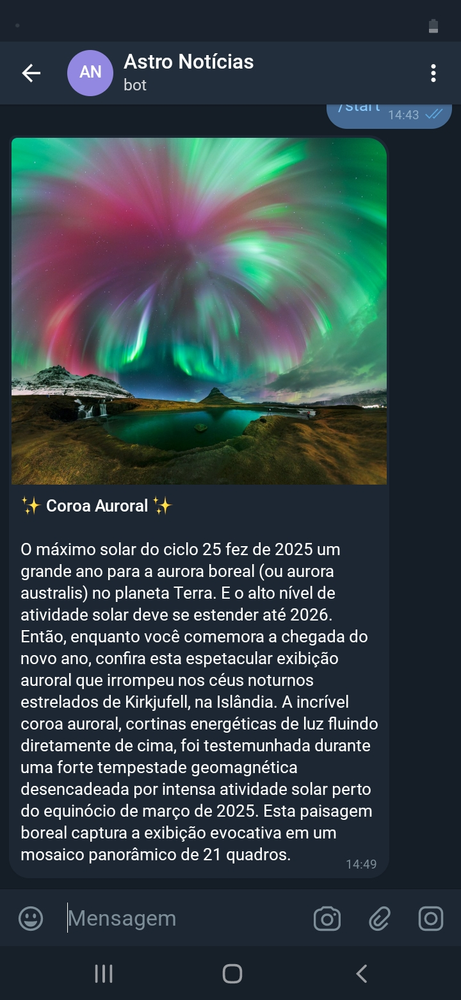

# NASA APOD Telegram Bot

##  Sobre o Projeto
Este é um bot automatizado para o Telegram desenvolvido inteiramente em Python. O objetivo do projeto é consumir a API oficial da NASA (Astronomy Picture of the Day - APOD) e enviar, de forma diária e automática, a imagem astronômica do dia acompanhada de sua explicação detalhada diretamente para o usuário.

Este repositório demonstra habilidades essenciais para a área de dados, como **integração com APIs RESTful**, **automação de tarefas (scheduling)**, manipulação de dados em formato JSON e aplicação de boas práticas de segurança utilizando variáveis de ambiente.

##  Bot em Ação
Abaixo, uma demonstração do bot recebendo os dados da API da NASA e enviando no chat do Telegram:



##  Tecnologias e Bibliotecas Utilizadas
* **Python 3**
* **Requests:** Para realizar as requisições HTTP e extrair os dados da API da NASA.
* **Python-telegram-bot:** Wrapper utilizado para a comunicação direta com a API do Telegram.
* **Schedule:** Para o agendamento da rotina diária de extração e envio das mensagens.
* **Python-dotenv:** Para garantir a segurança do código, ocultando credenciais sensíveis (Tokens e API Keys) em variáveis de ambiente.

##  Como executar o projeto localmente

1. Faça o clone deste repositório:
```bash
git clone [https://github.com/seu-usuario/nome-do-seu-repositorio.git](https://github.com/seu-usuario/nome-do-seu-repositorio.git)
